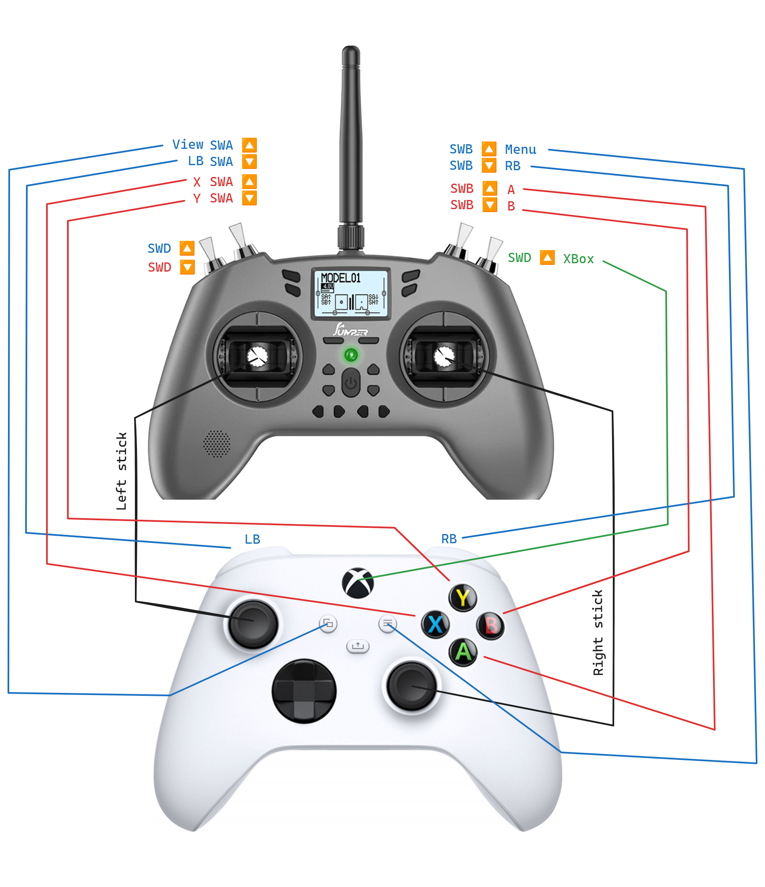

# XBox Controller Model for OpenTX/EdgeTX

The custom [OpenTX](https://github.com/opentx/opentx)/[EdgeTX](https://github.com/EdgeTX/edgetx) [model](./model01.yml), which can be found in this repository, has been specifically designed for use with the drone simulator [Liftoff: Drone Racing](https://www.xbox.com/en-US/games/store/liftoff-drone-racing/9NT7N192GP85) running on Xbox console. However, it is possible that it could also be compatible with other simulators. The default OpenTX model does not effectively align with the controls expected by the Xbox console, which is why custom adjustments needed to be implemented.

## Motivation

The problem at hand is that my gaming activities are solely limited to Xbox console, which means I do not own a PC that can support drone simulators. Consequently, after acquiring a [real drone controller](https://www.hobbyrc.co.uk/jumper-t-lite-v2-transmitter-elrs), I encountered difficulties in connecting it to Xbox.

## Resolution

The drone controller was successfully connected to the XBox console using [Greenlight software](https://github.com/unknownskl/greenlight), which enables remote play capabilities. Despite using a 5Ghz WiFi network, there is significant lag in the video stream. However, the controls are not heavily affected. This connection method can be used to integrate a custom controller into the Xbox ecosystem. It should be noted that the default drone controller model does not align well with the Xbox controls, resulting in controls that do not correspond to the expected behavior. To address this issue, I took the time to map most of the keys to the appropriate channels. Please refer to the diagram below for further details.

## Usage

[The model](./model01.yml) file can be easily copied from the repository and placed onto the SD card of the OpenTX/EdgeTX controller. It should be placed in the `MODELS` directory. If there is already a model with the same name, you may need to change the model number to avoid any conflicts. After completing these steps, you will find the model `Box HID` available in the list.

## References

- [EdgeTX Model Settings](https://edgetx.gitbook.io/edgetx-user-manual/b-and-w-radios/model-select)
- [Jumper T Lite V2](https://www.hobbyrc.co.uk/jumper-t-lite-v2-transmitter-elrs)
- [unknownskl/greenlight](https://github.com/unknownskl/greenlight)
